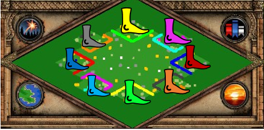
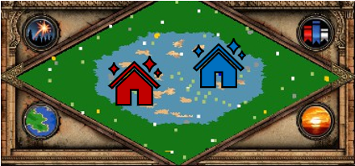
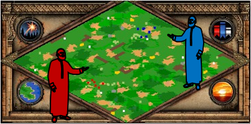
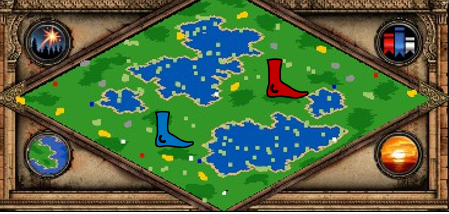

# To use: 
Copy and paste map into text file with filename ending with .rms (or you can download all maps in a zip file by clicking the green code button above). 

Paste the file into your Age of Empires 2 game directory - path should look something like /resources/_common/random-map-scripts. You may have to make a random-map-scripts folder if it doesn't already exist.

# Maps: 

## Reverse Arena

It's Arena... except your walls are around a different player. 

## Bog Socotra

Do demolition ships get a hill advantage?

## Crochetbia

Start with a monk - double the relics. 

## Ponds

Is it Nomad - or is it the land/water inverse of Team Island? 🤯

# Version notes
Version 1.0 maps were the ones used in the Lentil Cup 1.5 tournament. Patch notes will be added here as maps are updated. 